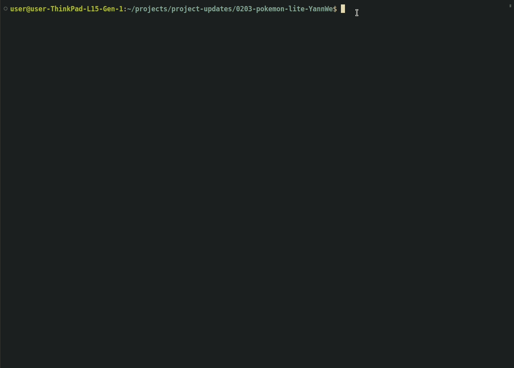

# Pokemon Fight Game

This was a project for the DCI JavaScript fundamentals module. I expanded upon the original task requirements to make it more interactive and fun. I actually know nothing about pokemon and had to google their attacks. A true pokemon fan will probably not approve of how I made this work ;)

Game is made with vanilla JS, runs in the terminal and is meant for 2 players.

## How-to:

1. Type **node index2.js** in the terminal to start a pokemon fight.
2. You'll see a list of pokemons. Each player can pick one when asked. Simply type in the name into the terminal.
3. When you've picked your pokemon, you'll see their stats displayed.
4. When its your turn to attack, simply type in the attack you want to use. 
5. Each Pokemon's attacks costs a certain amount of mana, so keep an eye on that. If you run out of mana, you can't attack and will have to skip a turn by typing skip. Skipping will replenish some of your mana. *hint: this can also be a tactic to use a stronger attack in the next turn*
6. Each pokemon also has defense. e.g. Jigglypuff's defense is 20. If its opponent has an attack of 45, Jigglypuff will only take 25 damage. If the attack strength is less than the defense points, no damage will be done.
7. First player to get the other to 0 or less health wins.

Have fun!
